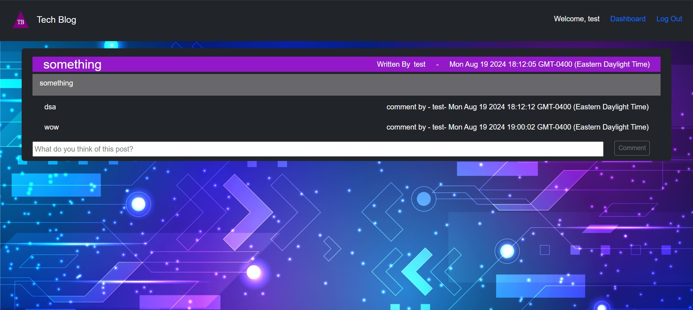
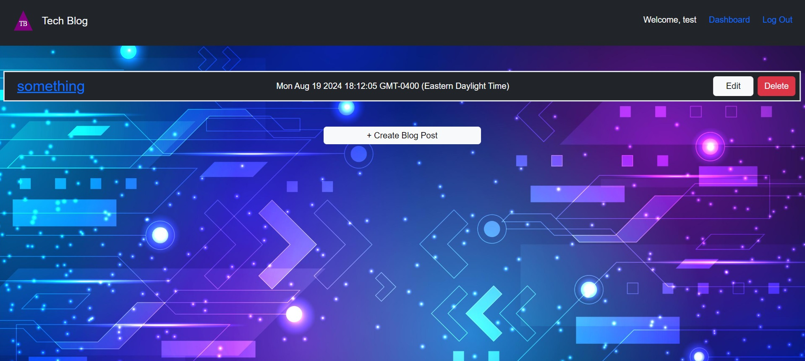
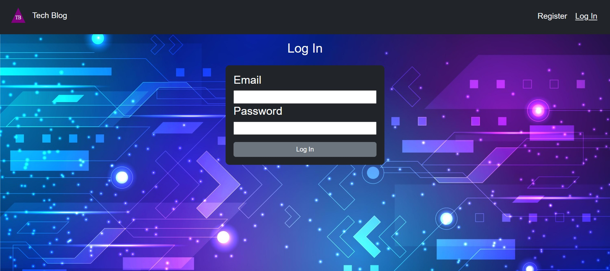
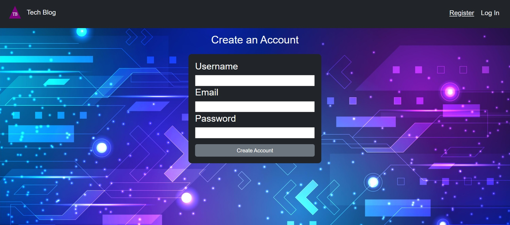

# Tech Blog
## Description
This project was undertaken as part of a coding bootcamp. For this challenge we were tasked with creating a full-stack blog website. The user shold be able to login securely. If they do not hav an account yet they should be taken to a register page. After logging is they are taken to their own dashboard page where they can create a blog post. They can also edit or delete past blog posts they created. If they click the logo they are taken to the homepage where they can see all users posts and can make comments on the posts.

## Installation
If you wish to run this project locally on your own computer, assuming you have git installed, input the following code in your terminal.
git clone https://github.com/philcurtis4/tech_blog_14
## Usage
The live site may be viewed at the following url.
https://YOUR_USERNAME.github.io/REPO_NAME/
Here is a screenshot of the page.

    
## Credits
This web app was created by Philip Curtis with some assisstance from the Rutgers Bootcamp Staff.
## License
This project has a MIT License. For more information read the LICENSE file.